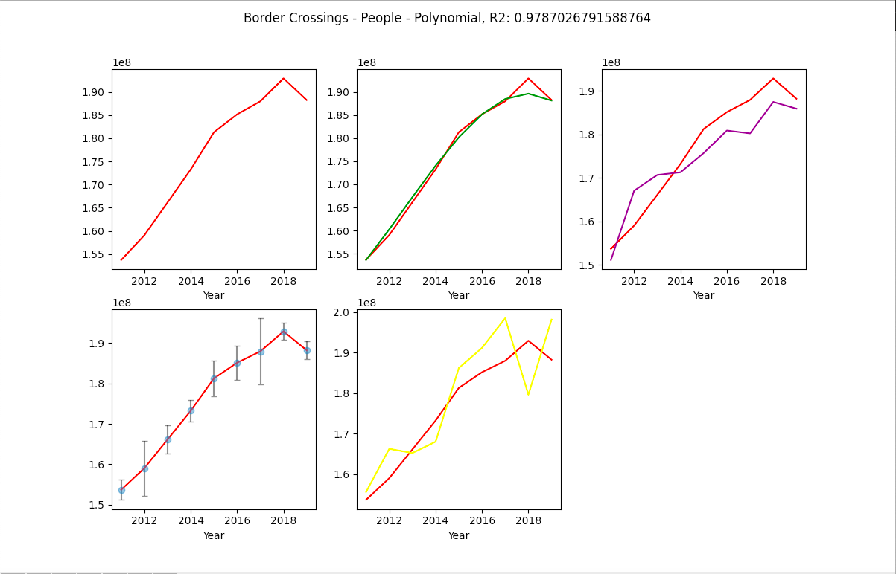

# Border Crossings

Line graph with Bokeh and polynomial regression model with Matplotlib and Excel of border crossings and money transfers between Mexico and US.

## General info
Graph of border crossings between US and Mexico between 2011-2019. People crossing border to US from Mexico and money remittance from US to Mexico. Datasets(add sources...)  

## Data sources
* Kaggle https://www.kaggle.com/
* Banco de México www.banxico.org.mx

## Screenshots

## Technologies
* Python
* Bokeh
* Pandas
* Matplotlib
* Excel

## Setup
Clone and run in optional IDE

## Features
* Bokeh line graph from excel-file
* Matplotlib polynomial regression plot with train and test set 

## Status
Project is: _finished_

## Contact
Created by Patrik Aarnivaara and Victor Goméz

