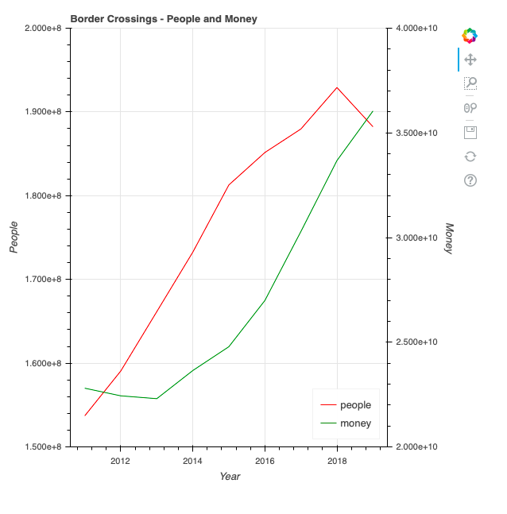

# Border Crossings

Graph of border crossings and money transfers.

## General info
Graph of border crossings between US and Mexico between 2011-2019. People crossing border to US from Mexico and money remittance from US to Mexico. Datasets(add sources...)  

## Screenshots

## Technologies
* Python
* Bokeh
* Pandas
* Matplotlib

## Setup
Clone and run in IDE

## Features
* Bokeh line graph from excel-file
* Matplotlib polynomial regression plot with train and test set 

## Status
Project is: _in progress_

## Contact
Created by Patrik Aarnivaara and Victor Goméz

